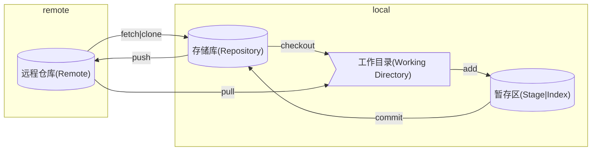

## 三个区域

Git 里主要分成 Working Directory、Staging Area、Repository 三个区域

| 名称       | 别称               | 描述                                    |
| ---------- | ------------------ | --------------------------------------- |
| 工作目录   | -                  | 即当前本地打开的目录                    |
| 暂存区     | 索引               | 保存了下次将提交的文件列表信息          |
| 存储库     | 版本库、本地版本库 | 隐藏目录 `.git`，用于本地存储提交的记录 |
| 远程存储库 | -                  | 用于接收本地存储库中的提交              |

## 关系图

:exclamation: 这个图说明了 Git 中各类操作形成的数据流转，理解这个图对学习 Git 十分重要



## 新建项目

```shell
mkdir git-test && cd git-test
git init
echo ".vscode" > .gitignore
echo "# Introduce" > README.md
```

## 连接到远程仓库

```shell
git remote add origin https://github.com/username/reponame.git
```

## 提交变更到暂存区

```shell
git add .
git commit -m "init"
```

## 推送到远程仓库

```shell
git push origin main
```

## 拉取变更

pull

## 克隆仓库到本地

clone

## 从本地存储库同步

checkout
