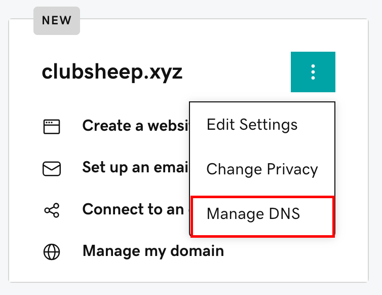

记录 DNS 解析记录的设置过程，作为备忘。

<!-- more -->

## 域名注册

国内也有域名注册服务，但是国内注册域名是需要备案的，对备案过程不了解，这里就选择国外的域名服务商了。我选择的是[GoDaddy](https://www.godaddy.com/en-sg)，有折扣的域名比较便宜

官网支持支付宝支付（如果遇到支付错误，很有可能是勾选了信用卡优惠码导致的）。

::: tip
去外网基本的英语能力或者翻译能力是要有的，详细步骤就不贴那么多图了。
:::

## 配置 DNS 解析记录

购买好了之后点击头像进入 My Products 就可以看到已购买到的域名。找到 manage DNS

点击后打开的页面分为四个板块，分别是 DNS Records、Nameservers、Forwarding、Premium DNS。

DNS Records 就是我们配置 DNS 解析记录的地方。下面表格解释了 DNS 解析记录都是干什么的。

| 记录类型 | 描述                                   |
| -------- | -------------------------------------- |
| A        | 将域名指向一个 IPv4 地址               |
| AAAA     | 将域名指向一个 IPv6 地址               |
| CNAME    | 将域名指向另一个域名                   |
| MX       | 指向邮件服务器地址                     |
| NS       | 该域名由哪个 DNS 服务器来进行解析      |
| TXT      | 做一些验证记录时会使用此项             |
| SRV      | 记录了哪台计算机提供了哪个服务         |
| SOA      | 在众多 NS 记录里哪一台才是主要的服务器 |

## 开始配置

找出你主机的 IPv4 地址和 IPv6 地址，这个我的主机管理界面就有。

1. 点击添加记录，类型选择 A，名称填你的域名或者`@`，值填你的 IPv4 地址，如果有代理设置为关闭。
2. 点击添加记录，类型选择 AAAA，其他同上。
3. 点击添加记录，类型选择 CNAME，名称填`www`，目标填你的域名

::: tip

示例：https://www.example.com

- `https://`为协议头
- `www`为二级域名
- `example.com`为一级域名

:::

## 关于 Cloudflare

1. 对应 nameservers 修改为 Cloudflare 提供的 nameservers
2. SSL/TLS 加密模式修改为完全(full)

::: warning SSL/TLS 加密模式

之前配置了子域名映射到`vercel`，然后打开一直提示重定向次数过多。一番查找之后发现是因为 vercel 的 ssl 配置与 cloudflare 冲突，把 cloudflare 的 ssl 配置修改为完全（严格）之后问题不再重现。

:::
