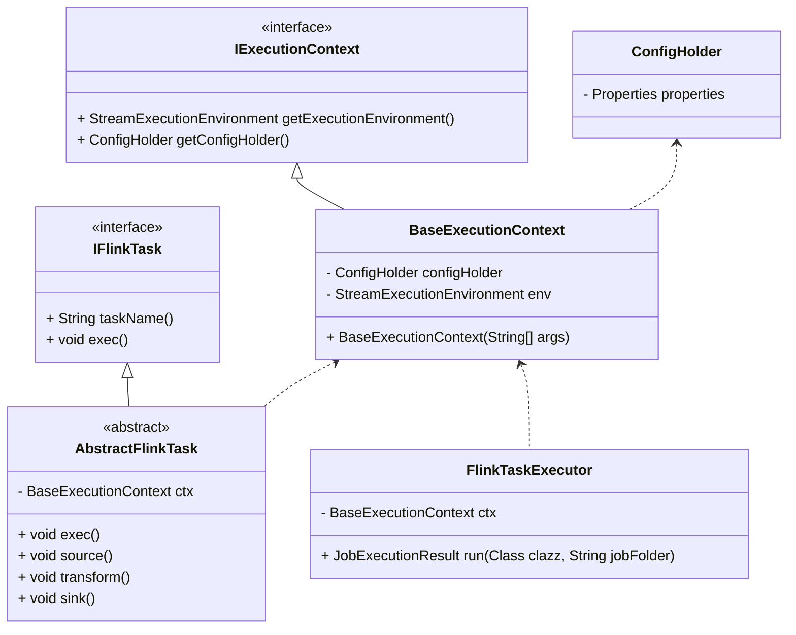
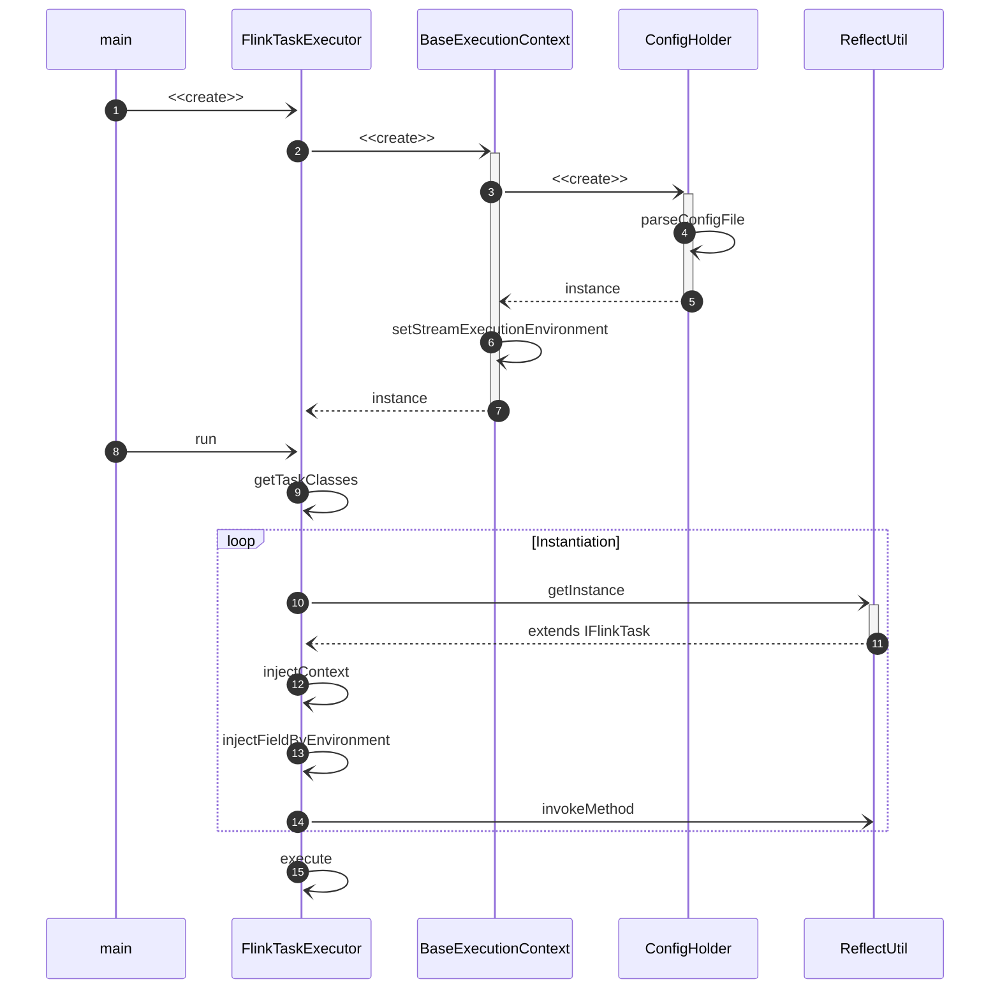

在公司写的 Flink 任务，过程中碰到的问题，在这里写下来，作为回顾总结。

<!-- more -->

## 需求

营销系统设计了几百个用户标签，经过讨论删选需要实现其中的五十几个用户标签。

## 设计图

### 程序架构设计

- IExecutionContext 提供 Flink 执行环境对象和环境配置，决定执行默认配置还是自定义配置
- IFlinkTask 抽象 Flink 任务的业务逻辑
- AbstractFlinkTask 进一步抽象了 source/transform/sink 方法，并使用 exec 方法依次执行
- FlinkTaskExecutor
  1. 通过 ClassLoader 加载所有实现 IFlinkTask 的类
  2. 通过 Reflect 为 Task 注入 Context

### 程序流程设计

开发步骤

1. 新建任务类继承 AbstractFlinkTask 抽象类，实现 source/transform/sink 业务逻辑
2. 新建入口类在 main 方法中实例化 FlinkTaskExecutor，并执行 run 方法

## 设计思考

::: info 为什么拆分成 source、transform、sink

1. 这样代码在分布上更加清晰
2. 这样设计在开发的时候，开发者就必须将数据流拆分成不同的部分，并提起出每一个阶段的数据流为字段在方法间传递。

   在进行单元测试的时候就可以较为方便的拿到不同阶段的数据流。

:::

## 开发中遇到的问题

::: info 公司存在两个不同版本的 ElasticSearch 环境，怎么让任务既可以写 ElasticSearch6 又可以写 ElasticSearch7 ？

这个问题最初有两个方向，一个是同事目前在用的，新建一个 git 分支，在新的分支下使用不同版本的 ES 依赖。另一个是从开源项目中借鉴的，使用 maven-shade-plugin 的 relocation 功能改变原依赖的包路径。目前使用第二种方案，将 ES6 和 ES7 分别打包成 shaded-es6 和 shaded-es7 两个依赖包。

:::

::: info 依赖版本问题

通过父项目的 DependencyManager 约定依赖版本

:::
