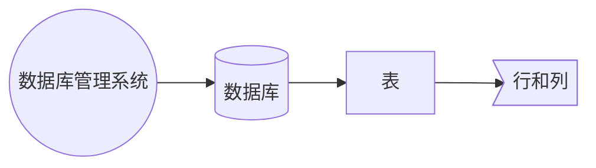

## 术语

- `SQL (Structured Query Language)`: 就是用于查询的编程语言，和其他编程语言一样有判断、函数、循环、异常捕获。
- `DDL (Data Definition Language)`: 数据定义语言、表结构、数据库结构创建  
  create 、drop 、alter
- `DML (Data Manipulation Language)`: 数据操作语言，数据的更改  
  select、update、delete、insert、truncate
- `RDBMS (Relational Database Management System)`: 关系型数据库管理软件
- `DB (Database)`: 数据库
- `Table`: 表用于实际承载数据，可类比于 Excel 文件，不过数据库的表还包含了索引、数据类型、约束、存储引擎等其他东西。
- `Row`: 翻译为行，存储一条记录，新建表的时候会约定这个表的结构，即每一行都是什么内容。
- `Column`: 通常存储同一类型的值

## RDBMS 的构成



## 介绍

### 功能

主要是存储数据用，可以类比于文件系统，他们的区别在于文件系统提供给用户是文件，而数据库提供给用户是数据

### 分类

#### RDBMS

| 数据库     | 描述                           | 性质           |
| ---------- | ------------------------------ | -------------- |
| Oracle     | 性能最好的，存储亿级别的数据量 | 商业版         |
| SQL Server | 性能相对差一些，千万级别数据量 | 商业版         |
| MySQL      | 市场占有率第一，存储千万级别   | 社区版（开源） |
| MariaDB    | MySql 社区分支版本             | 社区版（开源） |
| Derby      | Hive 默认单点数据库            |
| SQLite     | 小型程序内嵌数据库             | 社区版（开源） |

#### NOSQL

一般不支持 SQL 语言，有自己单独的语言，读写非常快

- Redis
- MongoDB
- Hbase

### 引擎

常见的引擎是下面两种

- MyISAM
- InnoDB

### MySQL 版本：

- 5.0 版本之前：功能不全
- 5.0 版本之后：视图、存储过程
- 5.7 版本之后：增加了分析窗口函数

## mysql 安装

[参考官方文档](https://dev.mysql.com/doc/refman/5.7/en/)

## 数据存储

数据存储位置通常在配置文件`my.cnf`中定义

- .ibd：存储了该表对应的数据和元数据索引信息等
- .frm：存储了表结构

## mysql 中的六大约束

| 约束           | 描述                                                                             |
| -------------- | -------------------------------------------------------------------------------- |
| NOT NULL       | 非空约束，修饰某一列所有的值不能为空                                             |
| DEFAULT        | 默认约束，修饰某一列，后面一般跟上一个默认值，如果该列没有赋值，那么就使用默认值 |
| UNIQUE         | 唯一约束，修饰某一列，该列所有值不重复                                           |
| PRIMARY        | 主键约束，修饰一列或多列，同时具有非空和唯一约束                                 |
| AUTO_INCREMENT | 自动增长，修饰的列必须为主键且类型必须为 int 类型                                |
| FOREIGN KEY    | 外键，修饰某一列，标识表中的值来自于另外一张表                                   |

::: tip 外键使用注意事项
创建表时：
先创建父表，然后创建子表

删除时：
先删除子表，然后删除父表
:::

## 使用引号

- 反引号：一般用于包裹列名、表名、数据库名、变量
  常规情况下可以省略
- 单引号：一般用于值（字符串）

```sql
GRANT ALL PRIVILEGES ON *.* TO 'root'@'%' IDENTIFIED BY '123456' WITH GRANT OPTION;
FLUSH PRIVILEGES;
```
