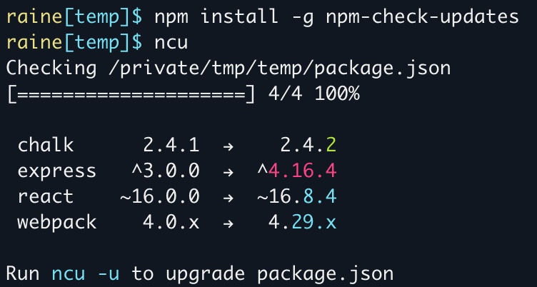

## 简介

npm-check-updates 是 package.json 中依赖更新管理工具，结局 `npm update` 仅更新 lock 文件中依赖的版本的问题

::: info taze

大家喜爱的 Anthony Fu 发布了 [taze](https://github.com/antfu/taze)，与 npm-check-updates 是同一类工具，可以期待正式版发布

:::

[<Badge text="Github 地址" vertical="middle" type="danger"/>](https://github.com/raineorshine/npm-check-updates)



- Red = major upgrade (and all major version zero)
- Cyan = minor upgrade
- Green = patch upgrade

::: tip

作者在介绍中推荐了[npm-check](https://github.com/dylang/npm-check)项目

:::

## 安装

```shell
npm install -g npm-check-updates
```

## 使用

### 检测当前项目中存在哪些包有新版本

````shell
$ ncu
Checking package.json
[====================] 5/5 100%

 express           4.12.x  →   4.13.x
 multer            ^0.1.8  →   ^1.0.1
 react-bootstrap  ^0.22.6  →  ^0.24.0
 react-a11y        ^0.1.1  →   ^0.2.6
 webpack          ~1.9.10  →  ~1.10.5

Run ncu -u to upgrade package.json```
````

### 更新项目 package.json 中的依赖

> Make sure your package file is in version control and all changes have been committed. This will overwrite your package file.

要确保你的项目使用了版本控制工具，且所有的修改都做了提交，因为这个操作会修改你的 `package.json` 文件

```shell
$ ncu -u
Upgrading package.json
[====================] 1/1 100%

 express           4.12.x  →   4.13.x

Run npm install to install new versions.

$ npm install      # update installed packages and package-lock.json
```

### 检测全局包的版本

```shell
ncu -g
```

### 进更新指定包

更新单个包

```shell
ncu mocha
ncu -f mocha
ncu --filter mocha
```

更新多个包

```shell
ncu chalk mocha react
ncu chalk, mocha, react
ncu -f "chalk mocha react"
```

### 使用正则匹配

```shell
ncu react-*
ncu "/^react-.*$/"
```

### 排除某一个包

```shell
ncu \!nodemon
ncu -x nodemon
ncu --reject nodemon
```

## 常用参数

- 使用 `--pre` 将包含预发布版本
- 使用 `--deprecated` 将包含弃用版本
- 使用 `--target minor` 将只升级次要版本
- 使用 `--target patch` 将只升级补丁版本
