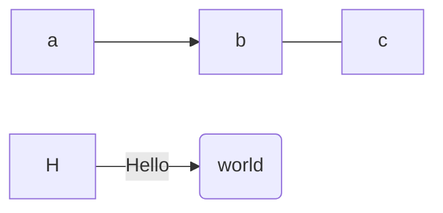

## tex

$2^3$

$$2^3$$

$$
\begin{aligned}
\text{a} & 1\\
\text{b} & 2E
\end{aligned}
$$

## VuePress2

主要缺点是目前还处于beta版本，而且社区开源的主题和插件还不够丰富。其他都是优点。

## Zola

是基于Rust语言的静态模板框架，需要学 tera 模板语法。页面相对较原始，没有一定的前端基础很难用。
