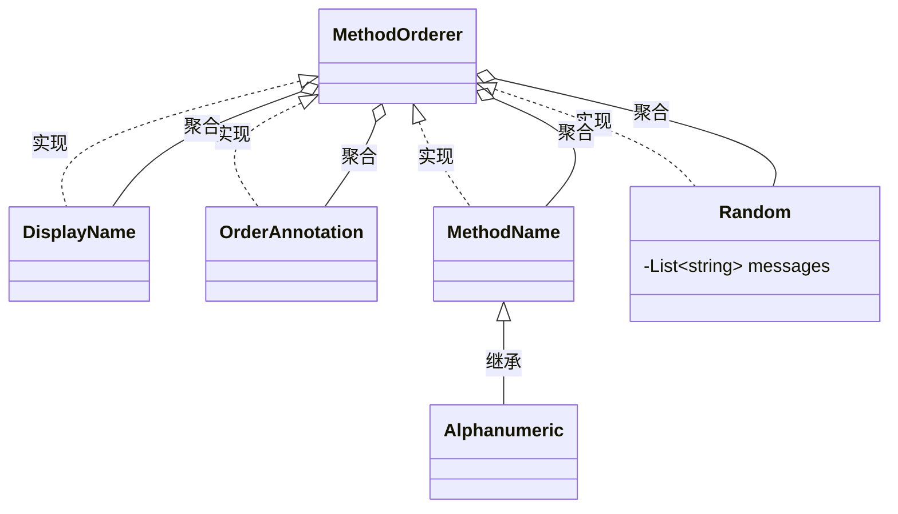

## 测试方法执行顺序

JUnit5 提供 `@Order` 和 `@TestMethodOrder` 两个注解配合

```java
@TestMethodOrder(MethodOrderer.OrderAnnotation.class)
public class Test{

  @Test
  @Order(1)
  void testMethod1(){}

  @Test
  @Order(2)
  void testMethod1(){}

}
```

MethodOrderer 类图



## Custom Argument Provider

传递测试参数的另一种高级方法是使用叫做 ArgumentsProvider 的接口的自定义实现：

```java
@ParameterizedTest
@ArgumentsSource(ArgProvider.class)
void name(String str, Class<?> clazz) {
  System.out.println(str);
  System.out.println(clazz);
}


class ArgProvider implements ArgumentsProvider {

  @Override
  public Stream<? extends Arguments> provideArguments(ExtensionContext extensionContext)
      throws Exception {
    return Stream.of(
        Arguments.of("US", US.class),
        Arguments.of("UK", UK.class),
        Arguments.of("CN", CN.class));
  }
}

// Output
US
class com.example.US
UK
class com.example.UK
CN
class com.example.CN
```

## 忽略测试

JUnit5提供了`@Disabled`注解来是测试不生效

```java
@Target({ElementType.TYPE, ElementType.METHOD})
@Retention(RetentionPolicy.RUNTIME)
@Documented
@API(
  status = Status.STABLE,
  since = "5.0"
)
public @interface Disabled {
  String value() default "";
}
```

JUnit4中使用的注解为`@Ignore`

```java
@Retention(RetentionPolicy.RUNTIME)
@Target({ElementType.METHOD, ElementType.TYPE})
public @interface Ignore {
  String value() default "";
}
```

根据元注解可以知道这两个注解都可以被标注在方法和类上

两者在大多数情况下是一致的，唯一的区别是在IDE中测试时显示效果JUnit5要更友好一点