## Sub & Sup 上下标

```markdown
H~2~O

x^2^ + y^2^ + 2xy = (x + y)^2^
```

H~2~O

x^2^ + y^2^ + 2xy = (x + y)^2^

## FootNote 脚注

```markdown
Java[^1]

[^1]: Java 是一门静态类型面向对象的语言。
```

Java[^1]

[^1]: Java 是一门静态类型面向对象的语言。

## Highlight 高亮

```markdown
==黄底黑字==
```

==黄底黑字==

## Anchor 锚

```markdown
[FootNote 脚注](#footnote-脚注)
```

[FootNote 脚注](#footnote-脚注)

## Table of content 目录

```markdown
[toc]

[[toc]]

[[_TOC_]]
```

[toc]

[[toc]]

[[_TOC_]]

## Define 定义

First Term
: This is the definition of the first term.

Second Term
: This is one definition of the second term.
: This is another definition of the second term.

## Mermaid

### Flowchart 流程图

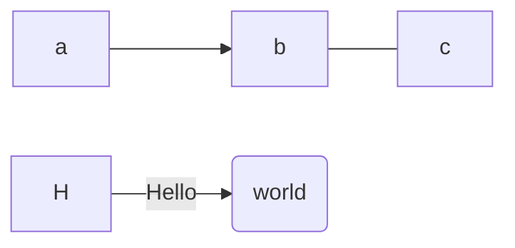

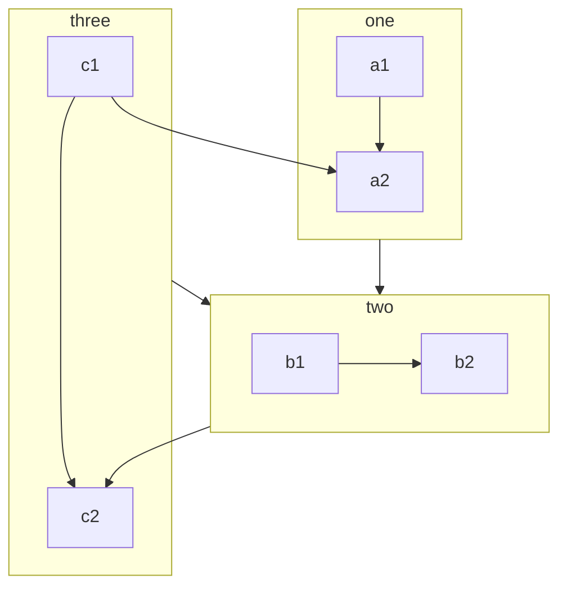

### Sequence diagram 序列图

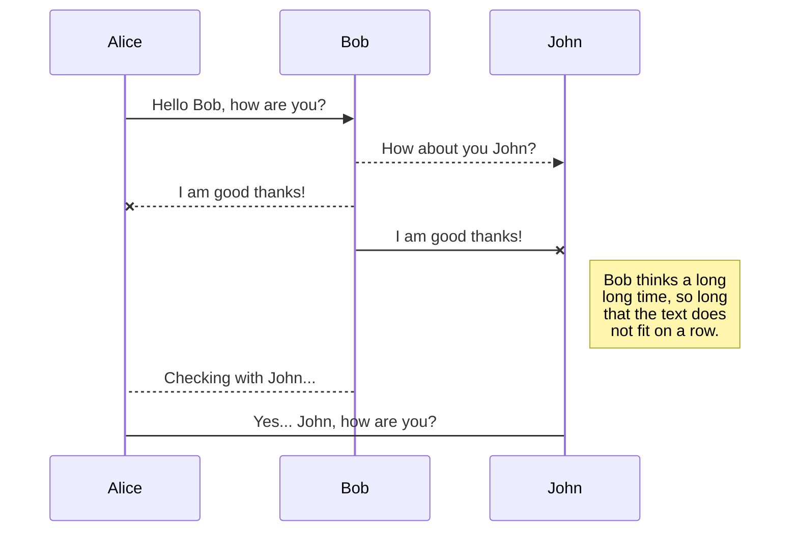

### Class diagram 类图

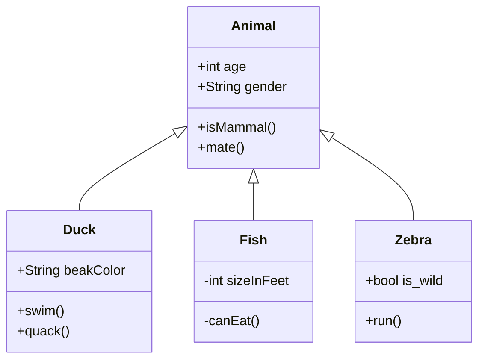

### State diagram 状态图

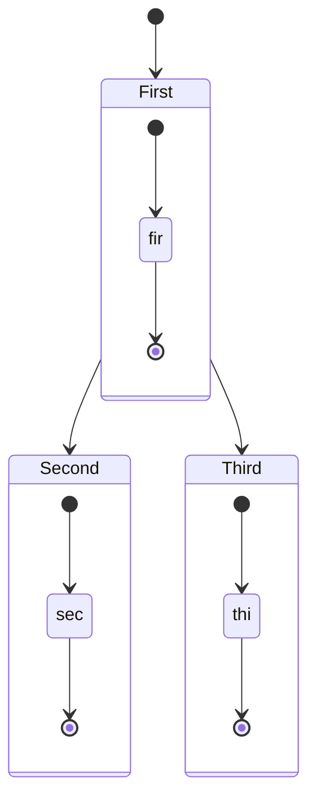

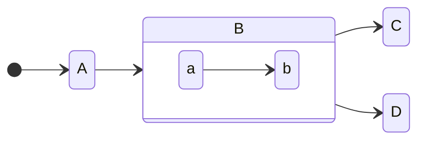

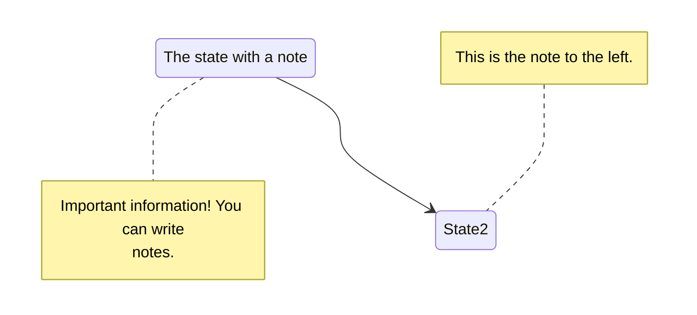

### ER 图

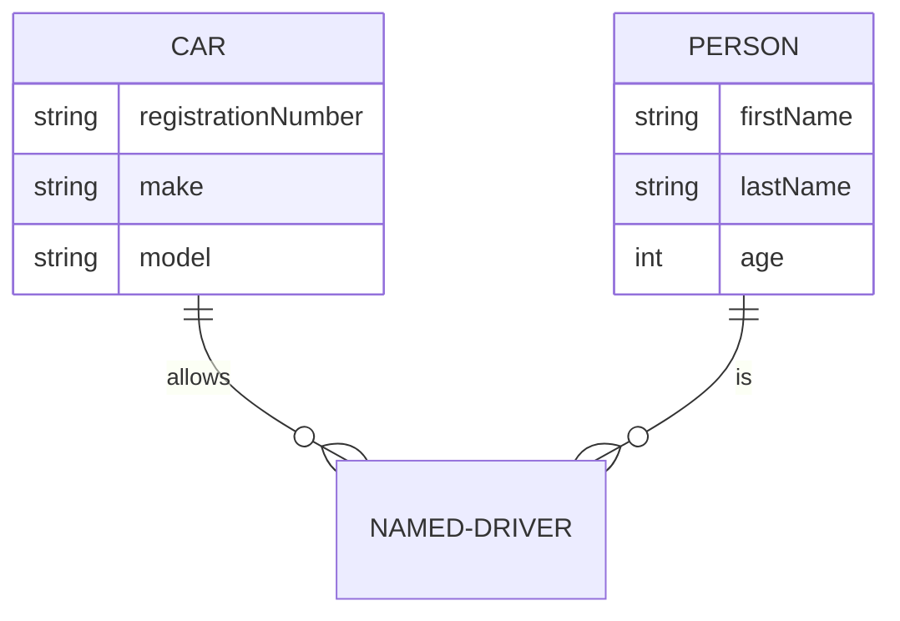

### User journey Diagram 用户体验图

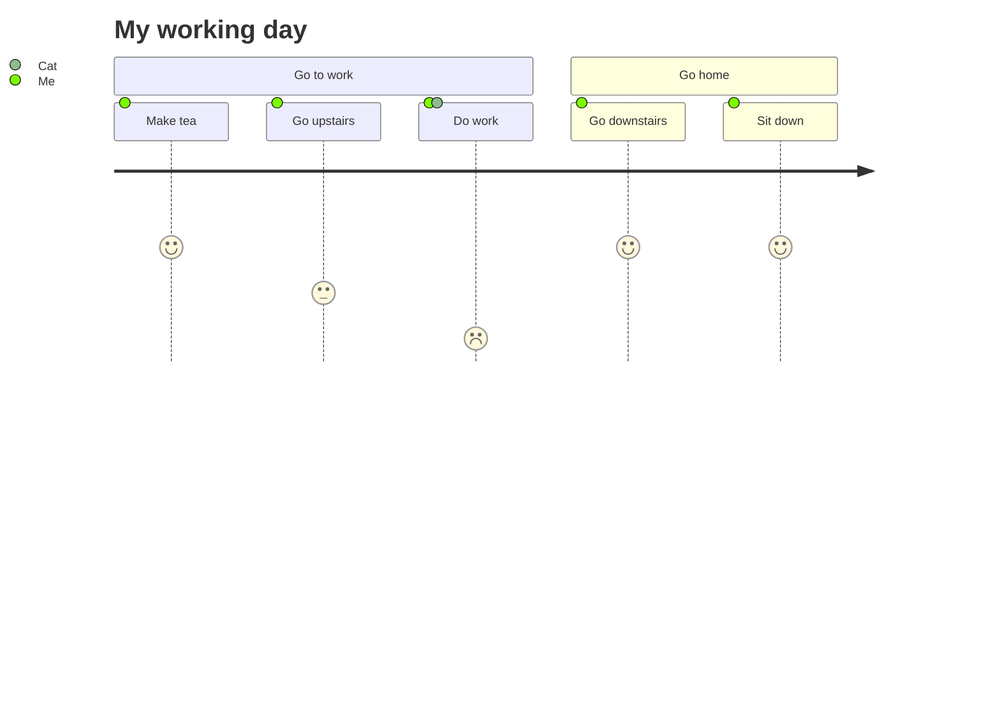

### Gantt 甘特图

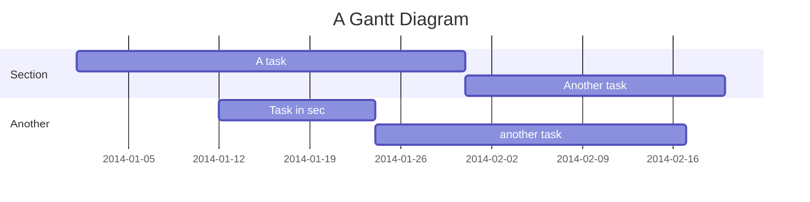

### Pie chart 饼图

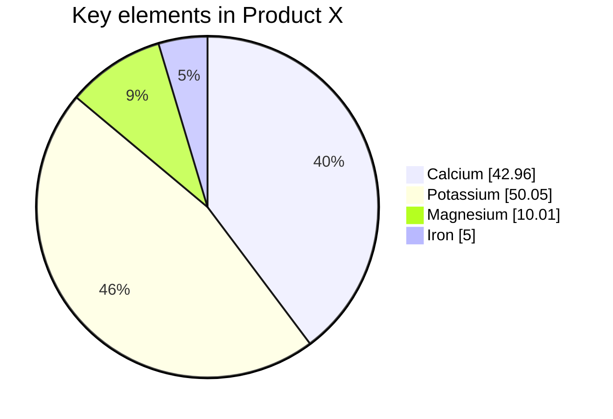

### Requirement diagram 需求图

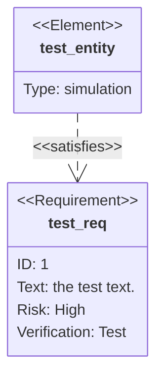

### Git 图

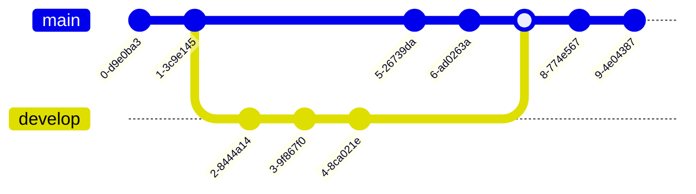

## Tex

```tex
$2^3$

$$2^3$$

$$
\begin{aligned}
\text{第一行：} & 1\\
\text{第二行：} & 2E
\end{aligned}
$$
```

$2^3$

$$2^3$$

$$
\begin{aligned}
\text{第一行：} & 1\\
\text{第二行：} & 2E
\end{aligned}
$$

```tex
$$
\frac {\partial^r} {\partial \omega^r} \left(\frac {y^{\omega}} {\omega}\right)
= \left(\frac {y^{\omega}} {\omega}\right) \left\{(\log y)^r + \sum_{i=1}^r \frac {(-1)^i r \cdots (r-i+1) (\log y)^{r-i}} {\omega^i} \right\}
$$
```

$$
\frac {\partial^r} {\partial \omega^r} \left(\frac {y^{\omega}} {\omega}\right)
= \left(\frac {y^{\omega}} {\omega}\right) \left\{(\log y)^r + \sum_{i=1}^r \frac {(-1)^i r \cdots (r-i+1) (\log y)^{r-i}} {\omega^i} \right\}
$$

### 对齐

```tex
$$
\begin{aligned}
x ={}& a+b+c+{} \\
&d+e+f+g
\end{aligned}
$$

$$
\begin{alignedat}{2}
   10&x+ &3&y = 2 \\
   3&x+&13&y = 4
\end{alignedat}
$$
```

$$
\begin{aligned}
x ={}& a+b+c+{} \\
&d+e+f+g
\end{aligned}
$$

$$
\begin{alignedat}{2}
   10&x+ &3&y = 2 \\
   3&x+&13&y = 4
\end{alignedat}
$$

### 分段函数

```tex
$$
y= \begin{cases}
-x,\quad x\leq 0 \\
x,\quad x>0
\end{cases}
$$
```

$$
y= \begin{cases}
-x,\quad x\leq 0 \\
x,\quad x>0
\end{cases}
$$


### 编号

```tex
$\tag{1} x+y^{2x}$

$\tag*{1} x+y^{2x}$
```

$$\tag{1} x+y^{2x}$$

$$\tag*{1} x+y^{2x}$$
