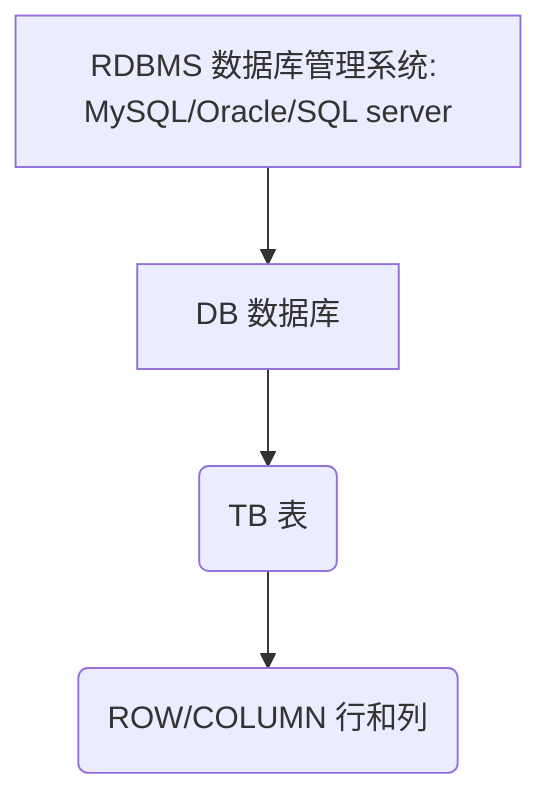

## 基本概念

### 什么是SQL

SQL(Structured Query Language结构化查询语言)

### 数据库管理软件的构成



- DDL：数据定义语言、表结构、数据库结构创建  
create 、drop 、alter
- DML：数据操作语言，数据的更改  
select、update、delete、insert、truncate

### 为什么要学MySql

1. 大数据开发

   - 大数据分析：java、SQL（统计分析类，大数据分析的主流）
     - 离线批处理
     - 实时处理
     - 交互式处理：Hive、impala、prestro、drill、Kylin

2. 侧重点是什么

    重点掌握SQL分析，熟悉数据库基本常识、运维管理。

## 数据库的介绍

数据库：DB（database）

- 功能：类似于数据仓库，存储数据用的 -> 同类型功能：文件系统
  - 区别：
    - 文件系统提供给用户是文件
    - 数据库提供给用户是数据
- 分类：
  - RDBMS：relation data base manager system (关系型数据库管理系统)
    - Oracle：性能最好的，存储亿级别的数据量
      - 商业版
    - SQL Server：性能相对差一些，千万级别数据量
      - 商业版 - 2017之前只支持windows
    - MySQL：市场占有率第一，存储千万级别
    - MariaDB: MySql社区分支版本
    - Derby：Hive默认单点数据库
    - SQLite：小型程序内嵌数据库
  - NOSQL：一般不支持SQL语言，有自己单独的语言，读写非常快
    - Redis
    - MongoDB
    - Hbase
- 特有名词：
  - MySQL：数据库管理系统 -> Excel软件
  - Database：数据库，是数据库管理系统中的第一层 -> Excel文件
  - Table：表，是数据库管理系统中的第二层，上层是数据库 -> sheet  
      所有表必须存在与数据库下面
    - Row：存储一条记录 -> 行
    - Column：存储同一类型的值 -> 列
  - SQL：Structured Query Language (结构化查询语言)
- MySQL中的引擎
  - MyISAM
  - InnoDB
- MySQL版本：
  - 5.0之前版本：功能不全
  - 5.0之后：视图、存储过程

    下载地址 <https://dev.mysql.com/downloads/mysql/>  
    Mysql 官方文档 <https://docs.oracle.com/cd/E17952_01/mysql-5.7-en/>

## mysql安装

### Windows 系统

1. 设置密码
1. 检测成功以后，点击next
1. 其他一路next

1. 配置环境变量

    path=原来的环境变量后面添加

    ```bat
    ;C:\Program Files\MySQL\MySQL Server 5.7\bin;
    ```

1. 测试登录

    ```sh
    mysql -h localhost -P 3306 -u root -p
        -h：登录的机器的地址
        -P：服务端的端口
        -u：指定登录的用户名
        -p：指定登录密码
    ```

### Linux 系统

#### CentOs7

1. 卸载mariadb，否则安装mysql会出现冲突

    ```sql
    rpm -qa | grep mariadb

    rpm -e --nodeps mariadb-libs-5.5.44-2.el7.centos.x86_64
    ```

    逐个将所有列出的mariadb rpm 包给卸载掉

2. 添加官方的yum源

    以centos7安装mysql5.7为例：

    ```sql
    vi /etc/yum.repos.d/mysql-community.repo
    ```

    将以下内容粘贴进去并保存

    ```sql
    [mysql56-community]
    name=MySQL 5.7 Community Server
    baseurl=http://repo.mysql.com/yum/mysql-5.7-community/el/7/$basearch/
    enabled=1
    gpgcheck=0
    gpgkey=file:///etc/pki/rpm-gpg/RPM-GPG-KEY-mysql
    ```

    centos7安装mysql5.7：

    ```sql
    baseurl=http://repo.mysql.com/yum/mysql-5.7-community/el/7/$basearch/
    ```

    centos6安装mysql5.6：

    ```sql
    baseurl=http://repo.mysql.com/yum/mysql-5.6-community/el/6/$basearch/
    ```

    centos6安装mysql5.7：

    ```sql
    baseurl=http://repo.mysql.com/yum/mysql-5.7-community/el/6/$basearch/
    ```

3. 安装

    ```sql
    sudo yum install -y mysql-community-server
    ```

4. 启动

    ```sqlsh
    sudo service mysqld start
    systemctl enable mysqld
    ```

5. 设置密码

    ```sqlsh
    mysqladmin -u root -p password 你的新密码
    ```

    注意：mysql5.7的初始密码是随机生成的，放在了 /var/log/mysqld.log

    使用命令 `grep 'temporary password' /var/log/mysqld.log` 读出来即可。

    ```sqlsql
    --直接改密码会报错
    SHOW VARIABLES LIKE 'validate_password%';
    set global validate_password_policy=LOW;
    
    ALTER USER 'root'@'localhost' IDENTIFIED BY 'root-password';
    ```

### Archlinux

1. 安装

    ```sh
    sudo pacman -S mysql
    ```

2. 设置密码

    ```sh
    ❯ sudo mysqld --initialize --user=mysql --basedir=/usr --datadir=/var/lib/mysql
    2020-05-16T11:15:01.535346Z 0 [Warning] [MY-010915] [Server] 'NO_ZERO_DATE', 'NO_ZERO_IN_DATE' and 'ERROR_FOR_DIVISION_BY_ZERO' sql modes should be used with strict mode. They will be merged with strict mode in a future release.
    2020-05-16T11:15:01.535407Z 0 [System] [MY-013169] [Server] /usr/bin/mysqld (mysqld 8.0.20) initializing of server in progress as process 3720
    2020-05-16T11:15:01.540019Z 1 [System] [MY-013576] [InnoDB] InnoDB initialization has started.
    2020-05-16T11:15:02.021759Z 1 [System] [MY-013577] [InnoDB] InnoDB initialization has ended.
    2020-05-16T11:15:03.172458Z 6 [Note] [MY-010454] [Server] A temporary password is generated for root@localhost: rdE<qQrN0.4N
    ```

    最后一行显示临时密码

3. 启动MySql

    ```sh
    sudo systemctl start mysqld
    sudo systemctl enable mysqld    #开机启动
    mysql -uroot -p'rdE<qQrN0.4N'
    ALTER USER 'root'@'localhost' IDENTIFIED BY 'wuhongbo'; #设置密码
    ```

## 实际数据存储目录

`datadir=C:/ProgramData/MySQL/MySQL Server 5.7/Data`

- .ibd：存储了该表对应的数据和元数据索引信息等
- .frm：存储了表结构

## mysql中的六大约束

1. NOT NULL

    不为空，修饰某一列所有的值不能为空

2. DEFAULT

    默认，修饰某一列，后面一般跟上一个默认值，
    如果该列没有赋值，那么就使用默认值

3. UNIQUE

    唯一，修饰某一列，该列所有值不重复

4. PRIMARY

    主键约束，修饰某一列，该列作为主键，同时具有非空和唯一约束

    主键：唯一标识一行

    通过主键查询，结果最多只有一条
    一般使用递增的序列或者id号作为主键

   1. 主键索引：

    | id  | name | age | sex |
    | --- | ---- | --- | --- |

    ```text
    查询所有年龄为18岁的人的姓名
    只有id索引：
        查询所有id将所有18岁的人的id过滤出来
        通过id查找对应的姓名
    有年龄索引：
        直接通过年龄查找所有的姓名
    ```

5. AUTO_INCREMENT

    自动增长，修饰某一列

   - 必须为主键
   - 类型必须为int类型

6. FOREIGN KEY

    外键，修饰某一列

- 使用A表中的某一列a为外键
- a列的值来自于B表中b列的值
    父表    子表
    B       A
- 要求：
  - A中的外键的取值来自于B中主键
  - 创建表时：
      先创建父表，然后创建子表
  - 删除时：
        先删除子表，然后删除父表
- 外键名在数据库中唯一，不能重复

## 使用引号的规范

一般都大写

- 反引号：一般用于包裹列名、表名、数据库名、变量
    常规情况下可以省略
- 单引号：一般用于值（字符串）

```sqlsql
GRANT ALL PRIVILEGES ON *.* TO 'root'@'%' IDENTIFIED BY '123456' WITH GRANT OPTION;
FLUSH PRIVILEGES;
```
