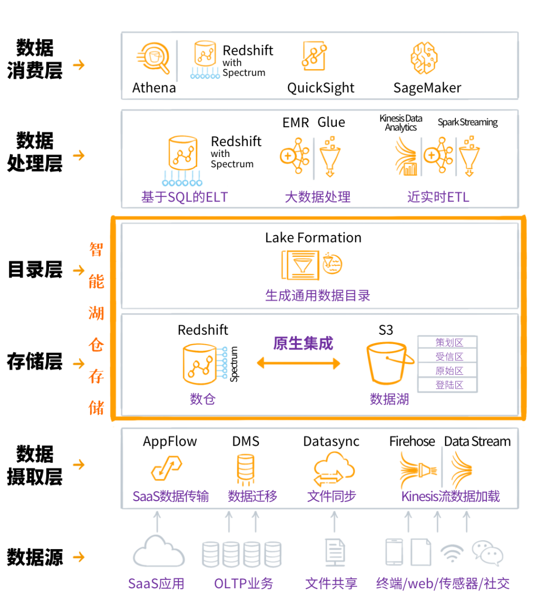

## 数据仓库是什么

首先我们复习一下什么是大数据的 4V 特性

> 大数据的 4V 特性：数据量极大、数据增长快、数据种类多、价值密度低。

大数据的定义其实很模糊，它并没有说明它所谓大的边界在哪里，广义上的大数据指的是围绕 Hadoop 的大数据组件生态圈，由 Hadoop 中 HDFS 组件提供分布式文件存储能力、Yarn 组件提供资源调度能力，MapReduce 组件提供大规模计算能力。在具备了这些能力之后大数据便有了实现的可能。在 Hadoop 诞生之后陆陆续续又出现了很多优秀的开源项目，比如较早的 Zookeeper 项目提供了集群高可用能力。Hive 项目提供了使用 SQL 读写 HDFS 上文件的能力，可以方便的在 HDFS 上构建数据仓库。HBase 项目提供了在 HDFS 上构建非关系型数据库的能力。

数据仓库之父兼计算机科学家 William Inmon 定义了数据仓库的 4 大特征，这 4 大特征为数据仓库的强大优势奠定了坚实基础。根据定义，数据仓库具有以下特点：

- 面向主题：数据仓库可以高效分析关于特定主题或职能领域（例如销售）的数据。
- 集成：数据仓库可在不同来源的不同数据类型之间建立一致性。
- 相对稳定：进入数据仓库后，数据将保持稳定，不会发生改变。
- 反映历史变化：数据仓库分析着眼于反映历史变化。

一个精心设计的数据仓库支持高速查询、高数据吞吐量，能够凭借出色的灵活性帮助用户细分数据或降低数据量，进而执行更加细致的数据检查，满足高层级和精细化数据管理等各种需求。同时，它还能为中间件 BI 环境（为最终用户提供报告、仪表盘和更多其他界面）提供一个坚实的功能性基础。

::: tip 相关资料

- [维基百科 - 数据仓库](https://zh.wikipedia.org/zh-sg/%E8%B3%87%E6%96%99%E5%80%89%E5%84%B2)
- [Oracle - 什么是数据仓库](https://www.oracle.com/cn/database/what-is-a-data-warehouse/)

:::

## 数据湖是什么

数据湖的就是原始数据保存区. 虽然这个概念国内谈的少，但绝大部分互联网公司都已经有了。国内一般把整个 HDFS 叫做数据仓库（广义），即存放所有数据的地方，而国外一般叫数据湖（data lake）

::: tip 相关资料

- [维基百科 - 数据湖](https://zh.m.wikipedia.org/zh-cn/%E6%95%B0%E6%8D%AE%E6%B9%96)
- [亚马逊云 - 什么是数据湖](https://aws.amazon.com/cn/big-data/datalakes-and-analytics/what-is-a-data-lake/)
- [知乎 - 数据湖总结](https://zhuanlan.zhihu.com/p/91165577)

:::

## 他们的异同

因为数仓是一个比较早的概念，出现在大数据技术成熟之前，所以数仓多指关系型数据库中搭建的数据仓库，数据湖是在大数据出现后出现的概念，由于大数据存储(HDFS、AWS 对象存储等)可以存放各种机构化或非结构化的数据，且随着技术的成熟，业界出现了 MPP(Massively Parallel Processing)架构数据库，因此有了下面的表格

|              | 数据仓库                                           | 数据湖                                       | 湖仓一体                                         |
| ------------ | -------------------------------------------------- | -------------------------------------------- | ------------------------------------------------ |
| 存储数据类型 | 适用于结构化数据                                   | 适用于半结构化和非结构化数据                 | 可以处理结构化、半结构化和非结构化数据           |
| 目的         | 最适合数据分析和商业智能 (BI) 用例                 | 适用于机器学习 (ML) 和人工智能 (AI) 工作负载 | 适用于数据分析和机器学习工作负载                 |
| 成本         | 存储成本高且耗时                                   | 存储具有成本效益、快速且灵活                 | 存储具有成本效益、快速且灵活                     |
| 酸合规       | 以符合 ACID 的方式记录数据，以确保最高级别的完整性 | 非 ACID 合规性：更新和删除是复杂的操作       | 符合 ACID 以确保多方同时读取或写入数据时的一致性 |

由于数据仓库指使用关系型数据库集中存储数据，所以存储数据类型为结构化数据，可以配合 Kettle、PowerBI 等工具实现数据分析、可视化、商业智能应用。由于像 Oracle、SQL Server 这类的关系型数据库对单节点硬件配置要求较高、且对于分布式部署支持有限，所以存储成本、运维成本都很高。

前面提到数据湖多基于 HDFS、AWS 对象存储等，由于这些存储架构对于节点配置要求不高，且原生支持分布式部署，能自适应的扩容节点，可以存储任意类型的数据，自然数据湖也就具备了这些特点。再搭配上 Mahout、QuickSight、SageMaker、FLink ML 等实现对数据的机器学习和预测分析等，下面放一张 Amazon 的数据湖架构图作为参考

数据湖的缺点也很明显，一方面大量松散数据存放在其中，需要有序的管理才能让数据湖不至于变成数据藻泽。另一方面数据湖的各项功能分散在不同的组件中，如果是使用云平台的话，每一个组件都需要学习如何使用；如果是自己搭建数据湖，这会需要巨大的运维成本。

数据湖也缺乏一些关键特性：它们不支持事务，它们不强制数据质量，并且它们缺乏一致性、隔离性，使得很难混合读写过程，以及批处理和流处理。

<!-- ## 数仓功能和特点

数据标准化、数据质量、一致性
提供增强商业智能
提高数据分析的能力

## 数仓分层 -->
