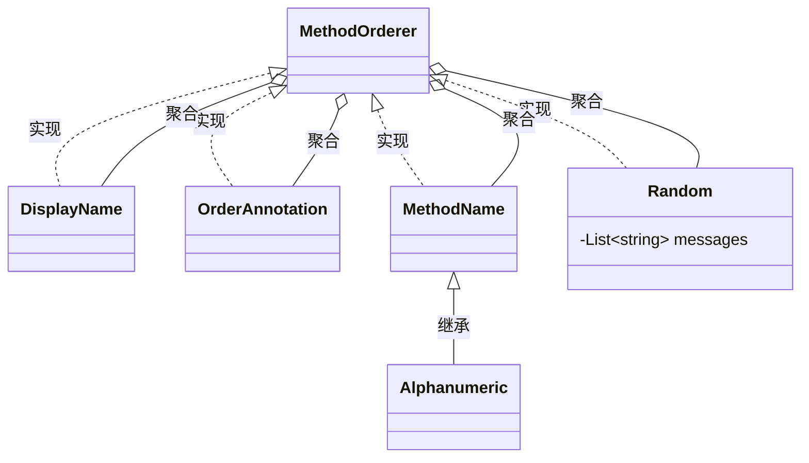

## 测试方法执行顺序

JUnit5 提供 `@Order` 和 `@TestMethodOrder` 两个注解配合

```java
@TestMethodOrder(MethodOrderer.OrderAnnotation.class)
public class Test{

  @Test
  @Order(1)
  void testMethod1(){}

  @Test
  @Order(2)
  void testMethod1(){}

}
```

MethodOrderer 类图



## Custom Argument Provider

传递测试参数的另一种高级方法是使用叫做 argumentsProvider 的接口的自定义实现：

```java
@ParameterizedTest
@ArgumentsSource(ArgProvider.class)
void name(String str, Class<?> clazz) {
  System.out.println(str);
  System.out.println(clazz);
}
```

```java
class ArgProvider implements ArgumentsProvider {

  @Override
  public Stream<? extends Arguments> provideArguments(ExtensionContext extensionContext)
      throws Exception {
    return Stream.of(
        Arguments.of("US", US.class),
        Arguments.of("UK", UK.class),
        Arguments.of("CN", CN.class));
  }
}
```

::: details Output

<pre style="padding:0;margin:0;border:0;">
US
class com.example.US
UK
class com.example.UK
CN
class com.example.CN
</pre>

:::
