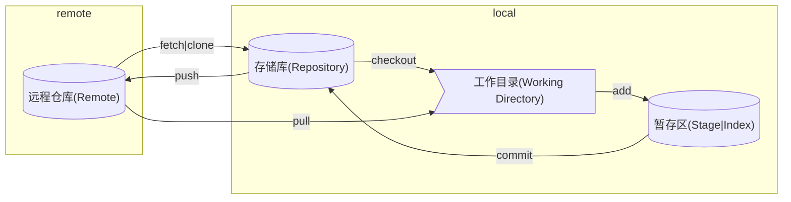

[Commit message 和 Change log 编写指南](http://www.ruanyifeng.com/blog/2016/01/commit_message_change_log.html)

## 工作区

Git 里主要分成 Working Directory、Staging Area、Repository 三个区域

| 名称       | 别称               | 描述                                                                         |
| ---------- | ------------------ | ---------------------------------------------------------------------------- |
| 工作目录   | -                  | 即当前本地打开的目录                                                         |
| 暂存区     | 索引               | 保存了下次将提交的文件列表信息，一般在 Git 仓库目录中，是一个叫 index 的文件 |
| 存储库     | 版本库、本地版本库 | 隐藏目录 `.git`，用于本地存储提交的记录                                      |
| 远程存储库 | -                  | 用于接收本地存储库中的提交                                                   |

他们之间完整的关系图如下

