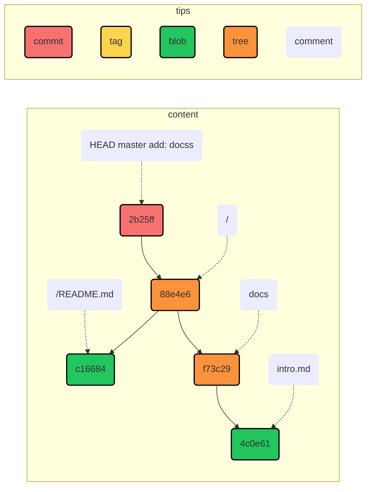
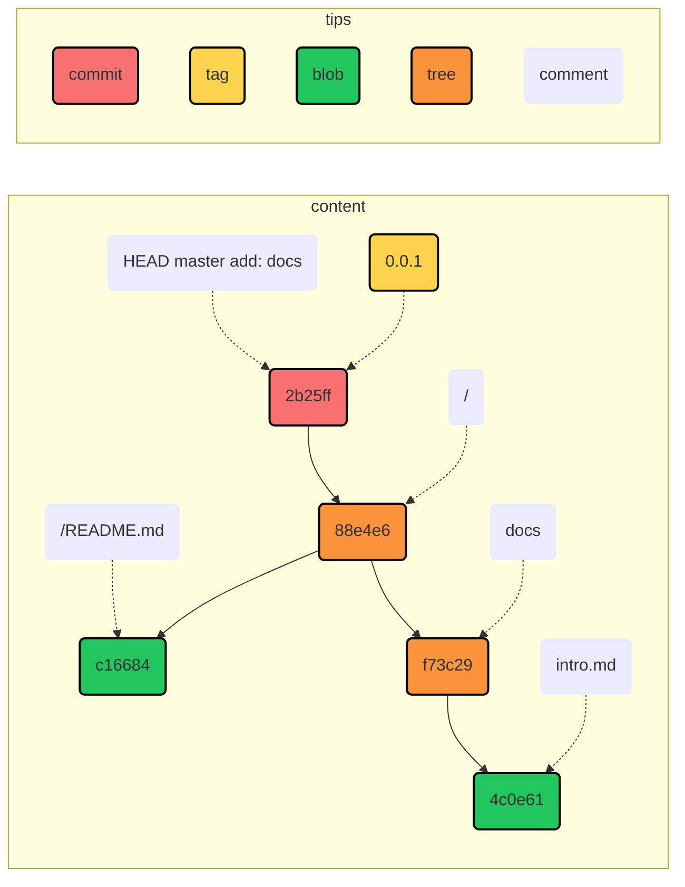

在 Git 里，有四个很重要的对象，分別是 Blob(Binary Large Object) 对象、Tree 对象、Commit 对象以及 Tag 对象。

## Blob 对象

我们从一个空项目开始，先在根目录下新建一个 README.md 文件，并把它添加到暂存区

```shell
mkdir git-test && cd git-test
git init
echo "# hello git" > README.md
```

看一下 Git 的状态

```shell
❯ git status
On branch main

No commits yet

Untracked files:
  (use "git add <file>..." to include in what will be committed)
        README.md

nothing added to commit but untracked files present (use "git add" to track)
```

这时候 README.md 文件还是未被追踪的状态，我们把它添加到暂存区

```shell
git add .
```

在 add 命令执行的时候，Git 首先会计算 README.md 文件的内容的 SHA-1 值，然后在 .git/objects 中以 SHA-1 值命名存放这个文件。我们看一下 git/objects 长什么样子

```shell {3-4}
❯ tree .git/objects
.git/objects
├── c1
│  └── 668483a7504a3ea10cf89b2885b526368fe2d2
├── info
└── pack
```

可以看到在 objects 目录下有一个 c1 目录，里面存放了一个名字很长的文件。我们可以通过 `git hash-object` 命令来看一下 README.md 文件的 SHA-1 值

```shell {2}
❯ git hash-object README.md
c1668483a7504a3ea10cf89b2885b526368fe2d2
```

或者也可以这样

```shell {2}
❯ echo "# hello git" | git hash-object --stdin
c1668483a7504a3ea10cf89b2885b526368fe2d2
```

不难看出 `git hash-object` 命令是对 README.md 文件的内容计算的 SHA-1 值，并且使用了前两个字符作为目录名，后面的 38 位作为文件名。

那这个文件又存放了什么呢？我们用 `git cat-file` 命令看一下

```shell
❯ git cat-file -t c1668483a7504a3ea10cf89b2885b526368fe2d2
blob

❯ git cat-file -p c1668483a7504a3ea10cf89b2885b526368fe2d2
# hello git
```

-t 表示查看文件的类型，-p 表示查看文件内容，可以看到这个文件的类型为 blob，内容为`# hello git`

## Tree 和 Commit 对象

我们新建一个 docs 目录

```shell
mkdir docs
```

然后看一下 Git 的状态

```shell
❯ git status
On branch main

No commits yet

Changes to be committed:
  (use "git rm --cached <file>..." to unstage)
        new file:   README.md
```

额，Git 并没有发现这个目录，之前添加 README.md 文件的时候会显示状态为未追踪，这里怎么就没有了呢？原因其实是 Git 进行 SHA-1 值是针对文件内容计算的，目录没有内容自然就无法计算。

::: info 拓展

由于上述规则，导致 Git 对于空目录是无感的，所以在很多时候，如果想要把这个目录让 Git 感知到，通常习惯是在这个目录下新建一个 .keep 文件。

:::

接下来在文件夹下新建一个文件

```shell
echo "# welcome" > docs/intro.md
```

这是我们再来看 Git 的状态

```shell
On branch main

No commits yet

Changes to be committed:
  (use "git rm --cached <file>..." to unstage)
        new file:   README.md

Untracked files:
  (use "git add <file>..." to include in what will be committed)
        docs/
```

Git 能检测到 docs 目录了，我们把它 add 到暂存区

```shell
git add docs
```

这时候 .git/objects 目录下多了一个目录和一个文件

```shell
❯ tree .git/objects
.git/objects
├── 4c
│  └── 0e618703add9755261e3d5d3b1cb8bac6bcbde
├── c1
│  └── 668483a7504a3ea10cf89b2885b526368fe2d2
├── info
└── pack
```

使用 `git cat-file` 查看文件类型和内容

```shell
❯ git cat-file -t 4c0e618703add9755261e3d5d3b1cb8bac6bcbde
blob

❯ git cat-file -p 4c0e618703add9755261e3d5d3b1cb8bac6bcbde
# welcome
```

接下来我们进行 Commit 看看会有什么变化

```shell
❯ git commit -m 'add: docs'
[main (root-commit) 2b25ff6] add: docs
 2 files changed, 2 insertions(+)
 create mode 100644 README.md
 create mode 100644 docs/intro.md

❯ ls -T .git/objects
.git/objects
├── 2b
│  └── 25ff61544283df6dc06b62a9d88262a87f2dc9
├── 4c
│  └── 0e618703add9755261e3d5d3b1cb8bac6bcbde
├── 88
│  └── e4e6006360e47ce9531e9586e1692ad9bb3feb
├── c1
│  └── 668483a7504a3ea10cf89b2885b526368fe2d2
├── f7
│  └── 3c29d62672bab41f605dcd5ff27ddb158af753
├── info
└── pack
```

多出来很多文件和目录，我们依次看看都是什么

```shell {1,4,11,14}
❯ git cat-file -t 2b25ff61544283df6dc06b62a9d88262a87f2dc9
commit

❯ git cat-file -p 2b25ff61544283df6dc06b62a9d88262a87f2dc9
tree 88e4e6006360e47ce9531e9586e1692ad9bb3feb
author rainbowatcher <rainbow-w@qq.com> 1655625464 +0800
committer rainbowatcher <rainbow-w@qq.com> 1655625464 +0800

add: docs

❯ git cat-file -t 88e4e6006360e47ce9531e9586e1692ad9bb3feb
tree

❯ git cat-file -p 88e4e6006360e47ce9531e9586e1692ad9bb3feb
100644 blob c1668483a7504a3ea10cf89b2885b526368fe2d2    README.md
040000 tree f73c29d62672bab41f605dcd5ff27ddb158af753    docs

❯ git cat-file -t f73c29d62672bab41f605dcd5ff27ddb158af753
tree

❯ git cat-file -p f73c29d62672bab41f605dcd5ff27ddb158af753
100644 blob 4c0e618703add9755261e3d5d3b1cb8bac6bcbde    intro.md
```

新出来的两个 tree 对象和一个 commit 对象，我们用一张图表示当前仓库的状态



图中的实线箭头表示类似指针的概念，表示 A 指向 B，如 2b25ff 是一个 commit 对象，它指向项目根路径 88e4e6。commit 对象会指向根目录的 tree 对象，而 tree 对象会指向其他 tree 对象或者 blob 对象。

## Tag 对象

tag 对象不会在 commit 过程中产生，而需要手动指定某个 commit 来设定 tag。我们试着制造一个 tag。

```shell
git tag -a 0.0.1 -m "first tag"
```

这时在 .git/objects 目录下多了 8e/3366c70256c1ca695505a83fbb5cc47369a251 文件，用 `git cat-file` 查看一下

```shell
❯ git cat-file -t 8e3366c70256c1ca695505a83fbb5cc47369a251
tag

❯ git cat-file -p 8e3366c70256c1ca695505a83fbb5cc47369a251
object 2b25ff61544283df6dc06b62a9d88262a87f2dc9
type commit
tag 0.0.1
tagger rainbowatcher <rainbow-w@qq.com> 1655632524 +0800

first tag
```

这时我们的 Git 图就变成了下面的样子



本文大量参考高见龙先生的[《为你自己学 Git》](https://gitbook.tw/)。
